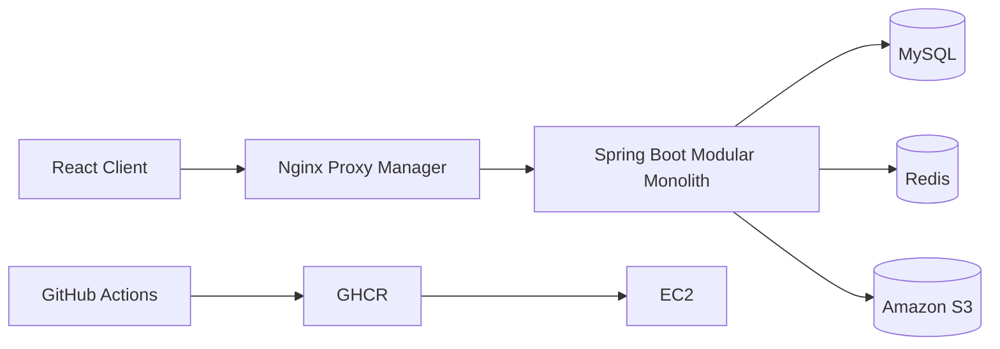

# AssetBox

> TA가 제작한 3D 에셋을 공유하고, 필요한 에셋의 요청부터 작업 완료까지 연결하는 협업 플랫폼

> **포트폴리오 핵심: 기존 파일을 다시 올리지 않는 ID 기반 이미지 동기화 API를 설계하고, S3 비용·권한·동시성·파일 lifecycle 문제를 함께 개선했습니다.**

- Repository: [Teabag-BE/Asset-Box](https://github.com/Teabag-BE/Asset-Box)
- 기간: 2026.05 ~ 2026.07
- 형태: 팀 프로젝트
- 담당: Backend — Request(에셋 요청 게시판) 도메인

## 프로젝트 소개

AssetBox는 교육 과정에서 제작한 3D 모델을 한곳에 모아 탐색·재사용하고, 원하는 에셋이 없을 때 TA에게 제작을 요청할 수 있도록 만든 플랫폼입니다.

단순 파일 게시판이 아니라 `요청 작성 → TA 배정 → 제작 진행 → 결과 게시글 연결 → 요청 완료`라는 업무 흐름을 서비스 안에서 추적할 수 있도록 구성했습니다. 저는 Request 도메인을 담당해 요청의 생성부터 결과물 연결까지 이어지는 백엔드 흐름을 구현했습니다.

## 포트폴리오에서 먼저 보여줄 결과

| 주제 | 설계 선택 | 결과 지표 |
| --- | --- | ---: |
| 참고 이미지 수정 | 기존 파일은 `fileId`, 신규 파일만 multipart로 전송 | 10개 중 2개 교체 시 S3 PUT **10회 → 2회** |
| 이미지 재정렬 | `sortOrder`만 갱신 | S3 PUT **0회**, DELETE **0회** |
| 요청 삭제 | 작성자·상태를 Service에서 검증 | 타인 삭제 성공 **0건** |
| 동시 변경 | `@Version` + HTTP 409 | lost update **0건** |
| 파일 수명 | 요청 삭제 시 참조 파일도 retention 대상 처리 | 고아 참조 파일 **0건** |
| 회귀 방지 | RequestPost 서비스·컨트롤러 테스트 보강 | RequestPost 테스트 **40개 → 43개** |

### 이미지 수정 요청의 데이터 흐름

```text
프론트엔드
  ├─ 기존 이미지: fileId + 최종 sortOrder
  └─ 신규 이미지: multipart file + 최종 sortOrder
          ↓
RequestPostService
  ├─ 현재 파일 소유 여부·중복 ID 검증
  ├─ 유지·삭제 파일의 차집합 계산
  ├─ 전체 순서 1..N 연속성 검증
  └─ 신규 파일만 S3 업로드, 삭제 파일은 retention 처리
```

파일명이나 URL 대신 영속적인 `fileId`를 계약 중심에 둔 덕분에, 재정렬만 하는 요청은 S3 객체를 다시 올리거나 지우지 않는다.

## 주요 기능

- 이메일 및 Google/Naver OAuth2 로그인, JWT 인증과 역할별 접근 제어
- 3D 에셋 게시글 CRUD, 카테고리·태그·검색, 좋아요·조회수
- ZIP 에셋 업로드, 모델·텍스처 추출, S3 Presigned URL 조회·다운로드
- 에셋 요청 CRUD, TA 배정, 상태 전이, 결과 게시글 연결
- 썸네일·다중 참고 이미지 업로드 및 수정 동기화
- 1:1 메시지, 댓글, 사용자 피드백
- Docker Compose, GitHub Actions, GHCR, EC2 기반 배포

## 기술 스택

| 구분 | 기술 |
| --- | --- |
| Backend | Java 25, Spring Boot 4, Spring MVC |
| Data | Spring Data JPA, QueryDSL, MySQL, H2 |
| Security | Spring Security, OAuth2 Client, JWT |
| Cache | Redis, Redisson |
| File | Amazon S3, AWS SDK, Presigned URL |
| Test | JUnit 5, Mockito, MockMvc, AssertJ |
| Infra | Docker, GitHub Actions, GHCR, EC2, Nginx Proxy Manager |

## 시스템 구성



---

## 담당 업무 및 기여

### Request 도메인 구현

- 요청 생성·단건/목록 조회·수정·소프트 삭제 API
- `REQUESTED → IN_PROGRESS → COMPLETED` 상태 전이
- TA 전공 사용자만 요청을 수락하도록 권한 검증
- 요청자의 자기 요청 수락 및 중복 배정 방지
- 결과 에셋 게시글 등록 시 연결된 요청 자동 완료
- 요청 썸네일과 다중 참고 이미지 업로드·조회·수정
- `@Version` 기반 RequestPost 낙관적 락과 충돌 응답
- Controller·Service·Domain 계층의 성공·실패 테스트

## 기술적 문제 해결

### 1. 요청 상태와 담당자 규칙을 코드로 강제

일반 CRUD와 달리 에셋 요청은 요청자와 작업 담당자의 역할, 현재 상태에 따라 허용되는 행위가 달랐습니다. 상태 변경 API만 열어두면 TA가 아닌 사용자의 수락, 자기 요청 수락, 중복 배정, 담당자가 아닌 사용자의 완료 처리가 가능했습니다.

`RequestPost`에 `assign()`과 `complete()` 행위를 표현하고 서비스에서 다음 규칙을 검증했습니다.

- 생성 상태는 항상 `REQUESTED`
- TA 전공 사용자만 수락 가능
- 요청자와 수락자가 같으면 거부
- 이미 배정되었거나 완료된 요청은 재수락 불가
- 배정된 담당자가 결과 게시글을 작성할 때만 완료 가능
- `IN_PROGRESS` 상태에서만 결과 게시글 연결 가능

도메인 규칙을 컨트롤러 밖에 두어 Post 등 다른 도메인에서 호출해도 같은 검증이 적용되도록 했습니다.

### 2. 결과 게시글과 요청의 생명주기를 한 트랜잭션으로 연결

결과 에셋 게시글을 작성한 뒤 요청을 따로 완료하면 한쪽만 성공해 데이터가 불일치할 수 있었습니다. 게시글 생성 입력에 `linkedRequestId`를 추가하고, 게시글 저장 흐름 안에서 요청 완료 서비스를 호출했습니다.

연결 대상 존재 여부, 담당자 일치, 현재 상태, 기존 결과 게시글 연결 여부를 검증한 뒤 게시글과 요청 상태를 함께 변경했습니다. 이로써 사용자가 별도 완료 API를 호출하지 않아도 요청에서 실제 결과물을 추적할 수 있게 했습니다.

### 3. 선택 파일이 없는 multipart 요청 안정화

클라이언트에 따라 선택 파일이 `null`, 빈 목록, 크기 0의 빈 `MultipartFile`로 전달됐습니다. 실제 파일이 없는데 업로드와 Presigned URL 생성을 시도하며 요청 작성이 실패하는 문제를 `hasFile()`과 `nonEmptyFiles()` 판별 로직으로 해결했습니다.

첨부 없음, 참고 이미지만 있음, 빈 파일 파트 전달의 세 가지 회귀 시나리오를 테스트해 클라이언트별 multipart 차이를 방어했습니다.

### 4. 기존·신규·삭제 참고 이미지 동기화

수정 화면에서는 기존 이미지 유지·순서 변경·삭제·신규 추가가 동시에 일어납니다. `ReferenceImageSyncRequest`로 기존 파일 ID와 정렬 순서, 신규 파일의 정렬 순서를 명시하도록 계약을 설계했습니다.

- 현재 파일과 유지 파일을 비교해 삭제 대상 계산
- 중복되거나 다른 요청에 속한 파일 ID 차단
- 기존·신규 이미지의 정렬 값이 `1..N`인지 검증
- 신규 파일 수와 정렬 값 수의 일치 검증
- 썸네일 교체 성공 후 이전 스토리지 객체 정리

Request 도메인은 수정 의도를 계산하고 File 도메인은 실제 저장을 담당하도록 경계를 유지했습니다.

### 5. RequestPost 버저닝으로 동시 수정 유실 방지

#### 문제

요청자와 배정된 TA가 비슷한 시점에 요청 내용이나 상태를 변경하면, 늦게 저장된 요청이 먼저 저장된 변경을 조용히 덮어쓰는 lost update가 발생할 수 있었습니다. 특히 내용 수정과 `IN_PROGRESS`·`COMPLETED` 상태 변경이 충돌하면 화면에는 성공으로 보이지만 실제 업무 상태가 되돌아갈 위험이 있었습니다.

#### 해결

- `RequestPost`에 JPA `@Version` 필드를 추가했습니다.
- 조회 응답에 `version`을 포함해 클라이언트가 최신 상태를 식별할 수 있게 했습니다.
- 저장 시 버전이 다르면 `ObjectOptimisticLockingFailureException`을 `REQUEST_VERSION_CONFLICT`로 변환했습니다.
- 충돌 응답은 HTTP `409 Conflict`로 통일하고 최신 요청을 다시 조회하도록 안내했습니다.
- 참조 이미지만 재정렬하는 요청도 `touch()`로 aggregate 갱신을 발생시켜 version을 증가시켰습니다.

#### 결과

| 동시 수정 정책 | 개선 전 | 개선 후 |
| --- | ---: | ---: |
| 같은 버전을 읽은 수정 요청 | 2건 모두 성공 가능 | 1건 성공, 1건 409 충돌 |
| 파일만 재정렬하는 수정 | version 갱신 보장 없음 | version 갱신 |
| 충돌 감지 위치 | 사후 확인 불가 | DB update 시점 즉시 감지 |

낙관적 락을 사용해 일반 조회에는 별도 잠금을 추가하지 않으면서, 실제 충돌이 발생한 요청만 재조회·재시도하도록 만들었습니다. 다음 단계에서는 `expectedVersion` 또는 `If-Match`를 수정 요청에 포함해, 순차적으로 발생하는 stale update까지 명시적으로 차단합니다.

## 리팩토링 전후

| 항목 | 리팩토링 전 | 리팩토링 후 |
| --- | --- | --- |
| 수정 서비스 호출 | 인터페이스에 없는 `updateFiles(...)` 호출 | `updateReferenceFiles(...)`로 컴파일·실행 복구 |
| 삭제 권한 | 로그인 사용자라면 타인 요청 삭제 가능 | 작성자 일치 여부 검증 |
| 요청 삭제 후 파일 | RequestPost만 soft delete | `REQUEST_REFERENCE`도 retention/purge 흐름 편입 |
| 파일 API | `/api/files/**` 익명 접근 | 인증 사용자만 접근 |
| 수정 충돌 | 늦은 저장이 앞선 변경을 덮을 수 있음 | `@Version` 충돌을 409으로 반환 |
| 상태 오류 응답 | 수정 불가 상태가 400 | 수정 불가 상태가 409 |

## 측정 시나리오와 목표

아래 결과는 같은 데이터셋(기존 PNG 1 MiB 10개), MySQL·S3 격리 환경, warm-up 5회 후 30회 측정의 p95 기준으로 기록합니다. 상세 실행 절차와 k6 스크립트는 `refactoring/설명/RequestPost_k6_부하테스트_가이드.md`에 정리했습니다.

| 시나리오 | 측정 항목 | 목표 |
| --- | --- | ---: |
| 10개 중 2개 교체 | S3 PUT | **2회** |
| 10개 재정렬 | S3 PUT / DELETE | **0회 / 0회** |
| RequestPost 수정 | p95 latency | **500ms** |
| 목록·상세 조회 | 오류율 | **0.1%** |
| 동시 assign 1,000회 | 이중 성공 | **0회** |
| S3 장애 주입 100회 | orphan object | **0건** |

## 검증

```powershell
.\gradlew.bat compileJava --rerun-tasks --no-build-cache --no-daemon
.\gradlew.bat test --tests "io.teabag.assetbox.request.*" --no-daemon
```

두 명령은 성공했습니다. 전체 테스트는 Redis 연결과 환경변수 placeholder가 필요한 기존 테스트 환경을 분리해 정비할 예정입니다.


## 회고

> 요청 게시판을 단순 CRUD가 아닌 상태·권한·파일·결과 게시글이 연결된 업무 흐름으로 설계하며, 도메인 경계와 트랜잭션 일관성을 코드와 테스트로 구체화했습니다.

## 향후 개선

- S3 작업과 DB 트랜잭션 사이의 보상 처리 확대
- 참고 이미지 동기화의 롤백·부분 실패 테스트 보강
- `expectedVersion`/`If-Match` 기반 stale update 차단
- assign 조건부 UPDATE와 1,000회 동시성 통합 테스트
- 요청글·파일 복합 인덱스를 `EXPLAIN ANALYZE`로 검증
- 완료 요청과 결과 게시글의 연결 데이터를 활용한 유사 에셋 추천
